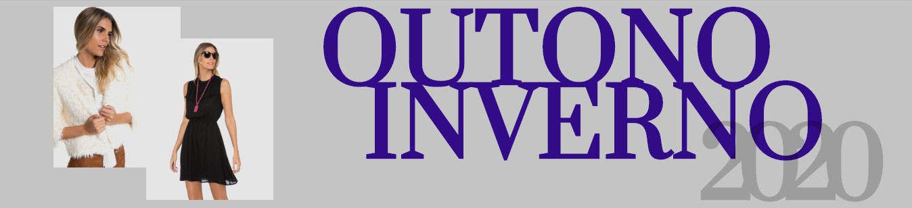

<p align="center">
  
</p>

Projeto final da **Aceleração React Women**,
um programa da [Codenation](https://codenation.dev/) com apoio da [Loft](https://www.loft.com.br/).

O programa teve três meses de duração, foi iniciado em Abril/2020 e finalizado em Junho/2020.

## Sobre o projeto **_FASHIONISTA_**

<p align="center">
  
</p>

### Cenário

Segundo o levantamento, da Webshoppers (Ebit / Nielsen), os e-commerces brasileiros faturaram cerca de R\$ 53,2 bilhões em 2018. O segmento “Moda e Acessórios” representa 5,6% do faturamento no varejo online, ocupando a segunda posição entre as categorias de produtos com mais pedidos, perdendo apenas para o segmento de eletroeletrônicos.

Oferecer a melhor experiência aos usuários que interagem com os produtos no desktop, e principalmente em dispositivos móveis, é fundamental para se manter vivo e competitivo nesse segmento.

### Objetivo

Desenvolver as principais funcionalidades de um e-commerce de moda feminina, o _Fashionista_, garantindo a melhor experiência possível para os usuários interagirem com os produtos.

### Regras

- Deve implementar as funcionalidades apresentadas nos wireframes / layouts.
- Deve ser mobile first, possuindo uma experiência satisfatória tanto em mobile quanto em desktop.
- Deve consumir a API do catálogo de produtos.
- O estado global da aplicação deverá ser gerenciado com Redux
- Deve ser um SPA (Single Page Application).
- Todos os produtos da API devem ser exibidos.
- Utilize BEM CSS para escrever os estilos.
- Deve-se fazer deploy do projeto, servindo-o no Netlify.
- Não utilize frameworks CSS como Bootstrap, Foundation e afins.

### Sobre o nosso projeto

Para desenvolver a aplicação utilizamos [React](https://github.com/facebook/react). Utilizamos [Redux](https://react-redux.js.org/) para manutenção do estado da aplicação, e para persistência do estado do carrinho de compras utilizamos o [Redux Persist](https://github.com/rt2zz/redux-persist). Para a tratativa das rotas utilizamos o [React Router](https://reactrouter.com/), e as requisições à API foram feitas utilizando [Axios](https://github.com/axios/axios). Também foram realizados testes da aplicação utilizando [Jest](https://jestjs.io/), e de acessibilidade utilizando o [NVDA](http://www.nvda.pt/pt-pt).

O _layout_ da aplicação foi modelado utilizando a ferramenta [Figma](https://www.figma.com/), e está disponível [neste link](https://www.figma.com/file/OCHbrdXbPId2oQPuhICc9S/Fashionista---Layout?node-id=0%3A1).

O _deploy_ foi feito utilizando o [Netlify](https://www.netlify.com/). O link para a aplicação é [https://react-women.netlify.app/](https://react-women.netlify.app/).

## Instruções para executar o projeto localmente

1. [Clone](https://help.github.com/pt/github/creating-cloning-and-archiving-repositories/cloning-a-repository) este repositório em sua máquina

```
git clone git@github.com:anacoxta/aceleracao-react.git

ou

git clone https://github.com/anacoxta/aceleracao-react.git
```

2. Acesse a pasta principal do repositório local utilizado linha de comando

```
cd aceleracao-react
```

3. Instale as dependências do projeto

```
npm install
```

4. Execute o projeto localmente, acessível através do endereço [http://localhost:3000](http://localhost:3000)

```
npm start
```

### **Observações**:

Este projeto foi criado usando [create-react-app](https://github.com/facebook/create-react-app).
Os requisitos mínimos para roda-lo são:

- Ter [Node.js](https://nodejs.org/en/download/) instalado localmente em sua máquina
- Um navegador de sua preferência
